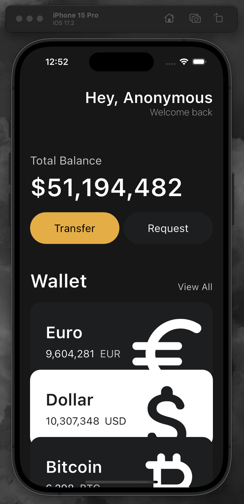

# Finance App_UI practice

## 프로젝트 소개

이 프로젝트는 금융 애플리케이션의 사용자 인터페이스(UI) 구성 연습을 위해 만들어졌습니다. 
특별한 기능 구현 없이, 순수하게 UI 디자인의 구현에 초점을 맞췄습니다.

## 디자인 특징

- **메인 화면**: 사용자에게 인사말과 함께 총 잔액을 보여줍니다.

- **계좌 이체 및 요청 버튼**: 이체 및 요청 기능을 위한 버튼을 시각적으로 표현했습니다.

- **지갑 섹션**: 다양한 통화와 금액을 한눈에 볼 수 있게 디자인했습니다.

## 기술적 구현

- **Flutter**: 이 앱은 크로스 플랫폼 호환성을 위해 Flutter를 사용하여 개발되었습니다.

- **디자인 컨셉**: 현대적이고 직관적인 사용자 경험을 제공하기 위한 명확하고 디자인을 적용했습니다.

- **레이아웃 구성**: 앱의 레이아웃은 사용자가 정보를 쉽게 파악하고 필요한 조치를 취할 수 있도록 구성되었습니다.

